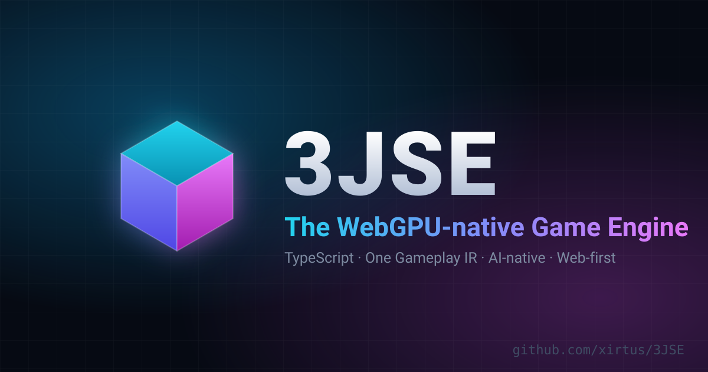
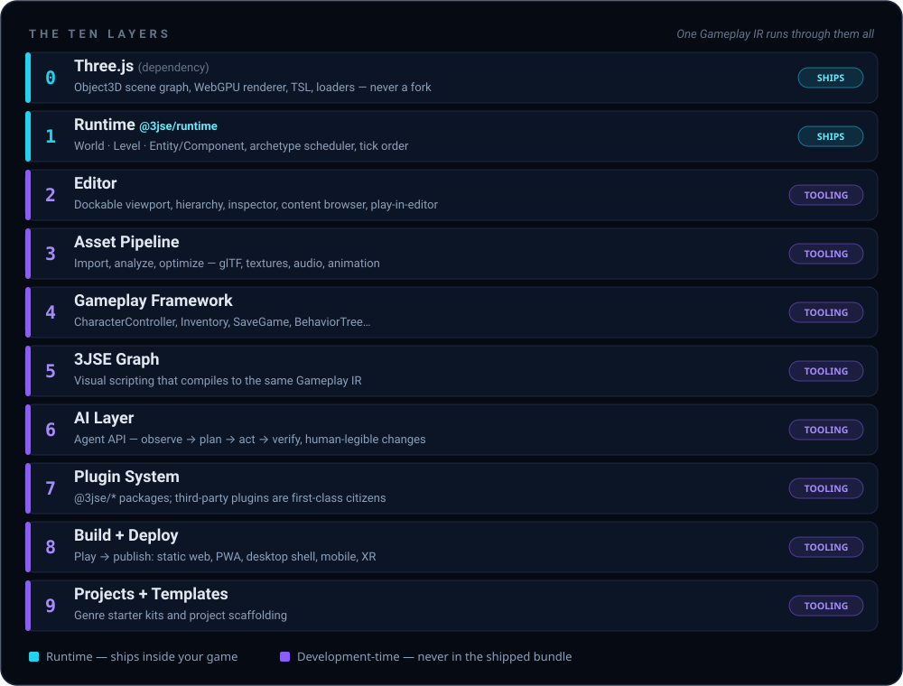

<p align="center">
  
</p>

<p align="center">
  <a href="https://github.com/xirtus/3JSE/blob/main/LICENSE"></a>
  <a href="#"></a>
  <a href="#"></a>
  <a href="#"></a>
  <a href="#"></a>
  <a href="#"></a>
  <a href="#contributing"></a>
</p>

> **"If Unreal Engine were invented today — for WebGPU, TypeScript, and AI-assisted development — what would it look like?"**
>
> That is the question 3JSE exists to answer. This is the answer.

---

## What is 3JSE?

**3JSE is an open-source game engine and editor for the platform that will run the next billion games: the web.**

Godot proved that open source can be world-class. Unreal proved what the bar is — a real editor, expressive visual scripting, a deep library of gameplay systems, and a pipeline that takes you from blank project to shipped game. 3JSE rebuilds *that* bar, natively, for the modern stack: **WebGPU, TypeScript, and AI-assisted development.**

It is built **around** Three.js — never on top of a fork of it. Three.js already won the "does the web have a real renderer" argument. What the web has never had is everything a renderer needs around it to become a *platform*. That gap — not rendering quality — is what 3JSE closes.

### Why 3JSE is the next engine, not another one

| | **3JSE** | Godot | Unreal Engine |
|---|---|---|---|
| **Language** | **TypeScript — one language, everywhere.** No separate scripting layer | GDScript / C# | C++ + Blueprints |
| **Editor boot** | **Instant.** It's a web app — also a Tauri desktop app | Seconds | Minutes |
| **Project format** | **Readable, git-diffable text files.** Your game is a software project | Text scenes | Binary `.uassets` |
| **Distribution** | **A URL.** Static web, PWA, desktop, mobile, XR — no multi-gigabyte installer | Exported binaries | Multi-GB installers |
| **AI-native** | **First-class.** An Agent API is the engine's core loop, not a bolt-on | Emerging | Emerging |
| **Rendering** | WebGPU via Three.js — and honest about it | Vulkan / GLES3 | Nanite / Lumen (the ceiling) |
| **License** | GPL-3.0 | MIT | Source-available, royalties |

3JSE doesn't chase Unreal's rendering ceiling — not in its first years. It fights where the web can win decisively: **speed of iteration, universality of distribution, and a codebase an AI agent can actually operate.**

### The big idea: one game, four frontends

Every engine forces you to pick a way of working — and then maintains four parallel, drifting versions of your game. 3JSE is built on a single decision: **one canonical, typed, serializable representation of what your game does** — the 3JSE Gameplay IR. Four ways of working edit the *same* game, never four parallel ones:

| Frontend | Who | How |
|---|---|---|
| 🎨 **Editor** | Artists & level designers | Drag, place, inspect, sculpt — a desktop-class, dockable GUI |
| 💻 **TypeScript** | Programmers | The same components, systems, and APIs the editor itself uses |
| 🕸️ **3JSE Graph** | Designers | Full visual scripting for gameplay — not a toy, not materials-only |
| 🤖 **AI agents** | Everyone, soon | Structured primitives via the Agent API — never simulated mouse clicks |

"AI-native" in 3JSE means something specific: an agent can read the game's state, plan a change, make it through the *same* command surface a human uses, **run the game to verify it**, and hand back a change that is legible to both the AI and the human.

---

## Architecture

Ten layers. Two of them ship in your game. The rest are tooling — and every one of them reads and writes the same Gameplay IR.

<p align="center">
  
</p>

The design principles that hold it together:

- **Three.js is a dependency, never a fork.** Three.js stays a normal, upgradable npm package. Any project can drop to raw Three.js at any layer without losing the engine.
- **One IR, many frontends.** TypeScript, 3JSE Graph, and AI agents all compile to the same Gameplay IR. No subsystem is allowed to become a second, opaque execution engine.
- **Everything the editor can do, code can do.** Every editor mutation is a call in the runtime's command API — the editor is a GUI for that API, not a separate authority.
- **Plugins are first-class.** The engine itself is a curated set of official plugins on a small core. Third-party physics, terrain, or gameplay packages install exactly like official ones.
- **Projects are software projects.** Scenes, prefabs, and graphs are readable, deterministic text files under version control — never a proprietary binary blob.

---

## Monorepo packages

| Package | What it does |
|---|---|
| [`@3jse/runtime`](packages/runtime) | The core: `World` → `Level` → `Entity`/`Component`, archetype scheduler, tick order. Standalone — zero editor dependency |
| [`@3jse/editor`](apps/editor) | The editor app (browser or Tauri) — a GUI for the runtime's own command API |
| [`@3jse/ir`](packages/ir) | The Gameplay IR: interpreter, JS/TS emitters, source-mapped round-trip between graphs and code |
| [`@3jse/animation`](packages/animation) | Animation graphs, state machines, blend trees |
| [`@3jse/character`](packages/character) | CharacterController, camera rig |
| [`@3jse/physics-rapier`](packages/physics-rapier) | Rapier physics integration |
| [`@3jse/save`](packages/save) | Save/load service and storage backends |

---

## Quickstart

```bash
# requirements: Node.js 20+, pnpm 11 (corepack enable)
git clone https://github.com/xirtus/3JSE.git
cd 3JSE
pnpm install

pnpm dev        # launch the editor
pnpm build      # build all packages
pnpm test       # run every test suite
pnpm typecheck  # strict type-check the monorepo
```

---

## The editor

A desktop-class, dockable GUI — viewport, hierarchy, inspector, content browser, graph editor, profiler — editing a **live** runtime in-process: play, pause, inspect, modify, resume. No rebuild, ever. It ships three ways from one codebase: **browser** (share a project by URL), **Tauri desktop** (the primary target), and games built with it never depend on the editor at runtime.

| Panel | What it does |
|---|---|
| **Viewport** | Live WebGPU render, gizmos, camera navigation, stats overlay |
| **Hierarchy** | Entity tree with prefab instances visually distinguished |
| **Inspector** | Schema-generated component editors, multi-edit diffing |
| **Content Browser** | Assets — meshes, textures, audio, prefabs, graphs — tagged, searchable, thumbnailed |
| **3JSE Graph** | Full-tab node canvas for gameplay logic |
| **Material / Shader Graph** | Node editor compiling to Three.js TSL |
| **Code Editor** | Embedded Monaco-class TypeScript editing with LSP |
| **Animation Tools** | Timeline, state machines, blend trees, skeleton view |
| **Physics Editor** | Collider gizmos, constraint authoring |
| **UI / HUD Editor** | Retained-mode layout canvas |
| **Profiler** | Frame timing by system, draw call, GPU pass |
| **Console** | Logs, warnings, errors — clickable to source, TS line or graph node |
| **Debugger** | Breakpoints, step, watch — across TypeScript *and* 3JSE Graph |
| **AI Panel** | The Agent API surface: observe → plan → act → verify |

---

## Roadmap

Dependency-ordered, not calendar-ordered — each phase proves what the next one depends on.

| Phase | Goal |
|---|---|
| **0 — Technical experiments** | De-risk the bets: IR round-trip, ECS-over-`Object3D` performance, editor shell |
| **1 — Editor MVP** | Build a scene visually with zero hand-written code |
| **2 — Gameplay Engine** | Components, prefabs, physics, input, saves, animation — a real game |
| **3 — 3JSE Graph** | Visual scripting that compiles to the same IR as TypeScript |
| **4 — AI-native authoring** | The Agent API loop — the engine an AI can operate |
| **5 — Professional tools** | Terrain, cinematics, VFX graphs, navigation |
| **6 — Ecosystem** | Templates, package sharing, multiplayer |
| **7 — Unreal-class workflow** | The full studio-grade suite, on the web platform |

Full details in [`docs/ROADMAP.md`](docs/ROADMAP.md).

> **Status:** 3JSE is in active, early development (Phases 0–2). The architecture is designed and documented; the foundations are being poured. Expect breaking changes — this is the moment to watch, shape, and build with it.

---

## Documentation

| Area | Docs |
|---|---|
| 🧭 **Core** | [Vision](docs/VISION.md) · [Architecture](docs/ARCHITECTURE.md) · [Runtime](docs/RUNTIME.md) · [Entity-Component Model](docs/ENTITY_COMPONENT_MODEL.md) · [World System](docs/WORLD_SYSTEM.md) · [Gameplay IR](docs/GAMEPLAY_IR.md) · [Visual Scripting](docs/VISUAL_SCRIPTING.md) · [Editor](docs/EDITOR.md) · [Gameplay Framework](docs/GAMEPLAY_FRAMEWORK.md) |
| ⚙️ **Systems** | [Physics](docs/PHYSICS.md) · [Animation](docs/ANIMATION.md) · [Audio](docs/AUDIO.md) · [Rendering](docs/RENDERING.md) · [Networking](docs/NETWORKING.md) · [Performance](docs/PERFORMANCE.md) |
| 📦 **Pipeline** | [Asset Pipeline](docs/ASSET_PIPELINE.md) · [Project Format](docs/PROJECT_FORMAT.md) · [Build & Deployment](docs/BUILD_DEPLOYMENT.md) · [Templates](docs/TEMPLATES.md) |
| 🤖 **Platform** | [AI Agent API](docs/AI_AGENT_API.md) · [Plugin Architecture](docs/PLUGIN_ARCHITECTURE.md) · [Vendor Integrations](docs/VENDOR_INTEGRATIONS.md) · [Verse Compatibility](docs/VERSE_COMPATIBILITY.md) |

---

## Contributing

3JSE is open source and just getting started — stars, issues, ideas, and pull requests all move it forward. If you've hand-built a scene-hierarchy UI, an undo stack, and a component system for the third time across three projects: this is your engine now.

See [`docs/ARCHITECTURE.md`](docs/ARCHITECTURE.md) for the design principles before contributing.

## License

[GPL-3.0](LICENSE) — free software, forever.

---

<p align="center">
  <i>The web is the biggest platform on Earth. It deserves a first-class engine.<br/>
  ⭐ <b>Star this repo</b> and build the future with us.</i>
</p>
