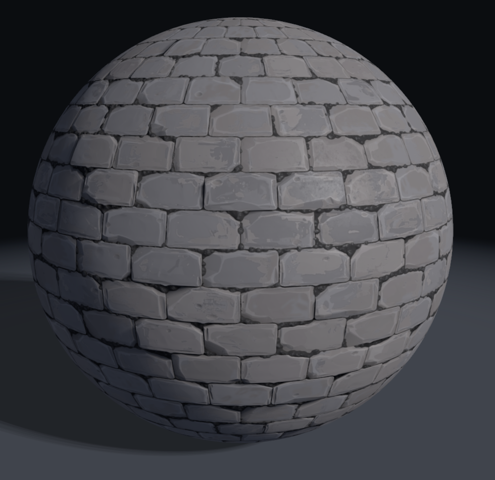
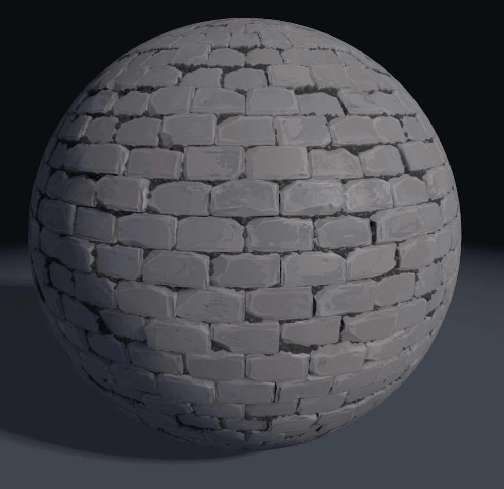
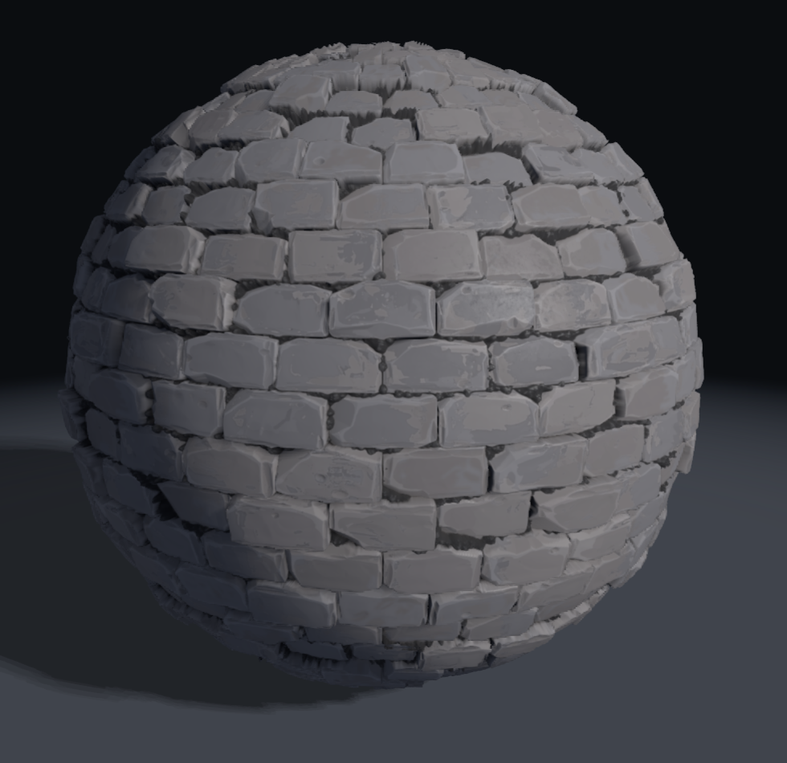
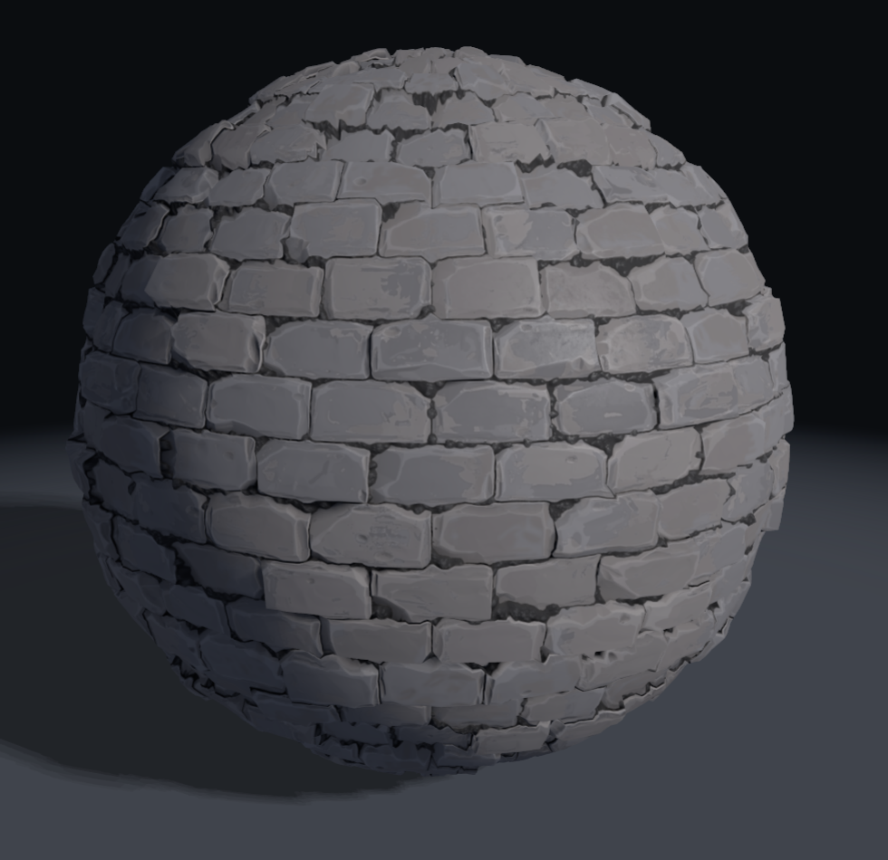
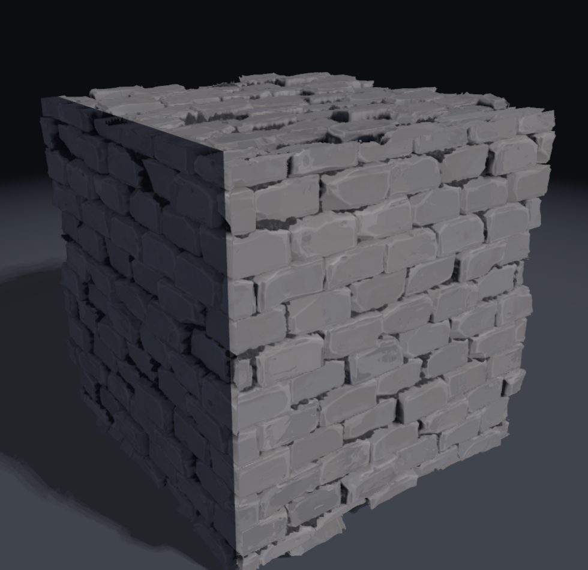

# apate

A three.js comparison of four ways to fake (or actually build) surface relief, on one shared
shader and one brick material. Switch technique, shape and view independently and watch what
each approach costs and what it gets wrong.

> *Apate*: the Greek spirit of deceit. Three of these four modes are lying to you about geometry.

## The four modes

All four below are the **same camera, same material, same depth (0.11)**. Only the technique changes.

| | |
|:--:|:--:|
| **1. Standard**: normal map only | **2. POM**: parallax occlusion mapping |
|  |  |
| Bricks are flat. Lighting implies depth, but nothing shifts as you orbit and the outline is a clean circle. | The surface parallaxes correctly and mortar occludes properly, but the silhouette is *still* a clean circle. That edge is the giveaway. |
| **3. SPOM**: silhouette POM | **4. Displaced**: real geometry |
|  |  |
| Raymarches a shell in world space and discards rays that pass through it. Bricks break the outline. **16,128 tris**, the same mesh as 1 and 2. | Ground truth: vertices actually moved. Nearly identical to SPOM, for **65,024 tris**, 4x the geometry. |

The pair to look at is **2 vs 3**: identical across the face, completely different at the rim.
Then **3 vs 4**: nearly identical everywhere, 4x apart in triangles.

## Running it

Needs **Node `^20.19` or `>=22.12`** (Vite 8) and a browser with WebGL2.

```bash
npm install
npm run dev
```

## A shape is just a norm

The interesting bit is `src/shell.glsl`. SPOM doesn't special-case each shape. The shell is
"everything within `uExtent` of the origin under this norm", and swapping the norm swaps the shape:

```glsl
if (uShape == 1) return max(max(abs(p.x), abs(p.y)), abs(p.z));  // L-inf     -> cube
if (uShape == 2) return max(length(p.xz), abs(p.y));             // L2 in xz  -> cylinder
return length(p);                                                // L2        -> sphere
```

The raymarch, the tangent frames and the ground's cast shadow all run through that one function,
so adding a shape means adding a norm and a uv mapping, not a new renderer.



SPOM on a cube: **12 triangles**. Every notch in that outline is a discarded ray, not geometry.
This is the case that matters for architecture, because a flat wall has nothing for a silhouette
to do in its middle, so all the work happens at rooflines, corners and window reveals.

## Controls

| Group | Options |
|---|---|
| **Shape** | Sphere · Cube · Cylinder |
| **Rendering mode** | Standard · POM · SPOM · Displaced (keys `1`-`4`) |
| **View** | Shaded · Normal map · Wireframe. Composes with the mode, so *Normal map* under POM shows the *parallaxed* normal map |
| **Lighting & scene** | Self-shadowing · Ground · TAA |
| **Depth** | Relief height, in uv units. Everything scales from this. |
| **Steps** | March samples. Drop it to ~12 to watch POM fall apart. |

Drag to orbit, scroll to zoom. The stats panel reads triangles, GPU ms (via
`EXT_disjoint_timer_query_webgl2`) and CPU ms.

## Notes

- Lighting is deliberately simple and identical across all four modes, so switching mode shows
  the technique and nothing else.
- Self-shadowing has two implementations: tangent-space uv for the height-field modes, and a
  world-space shell march for SPOM. Both are tuned to the same hardness, so the same surface
  shadows the same way either way.
- The ground's cast shadow marches the same displaced surface the object does, so it carries the
  real relief rather than a smooth bounding blob.

Textures are a 1k brick set (`bricks_wall_07`) in `public/textures/`. Check their original
license before reusing them; this repo's MIT license covers the code.
