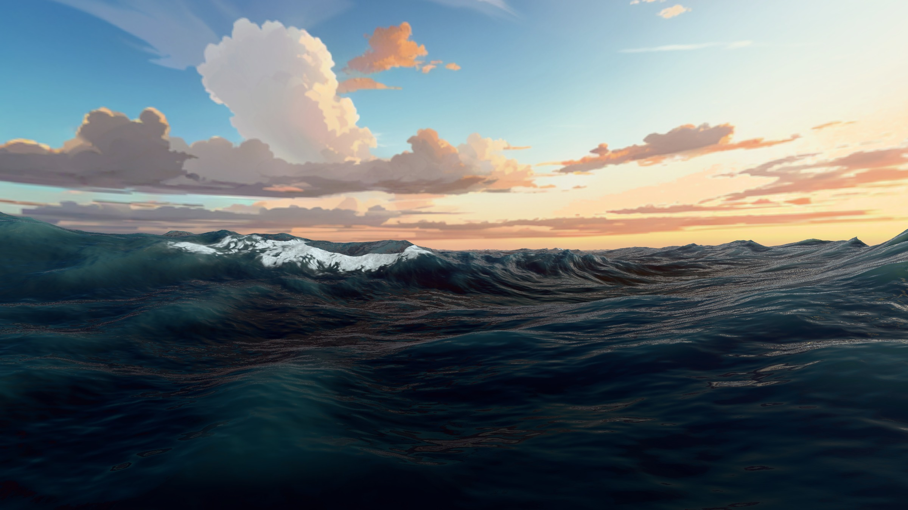
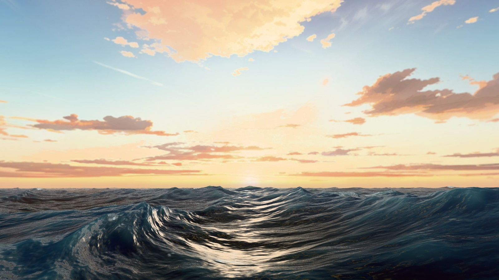
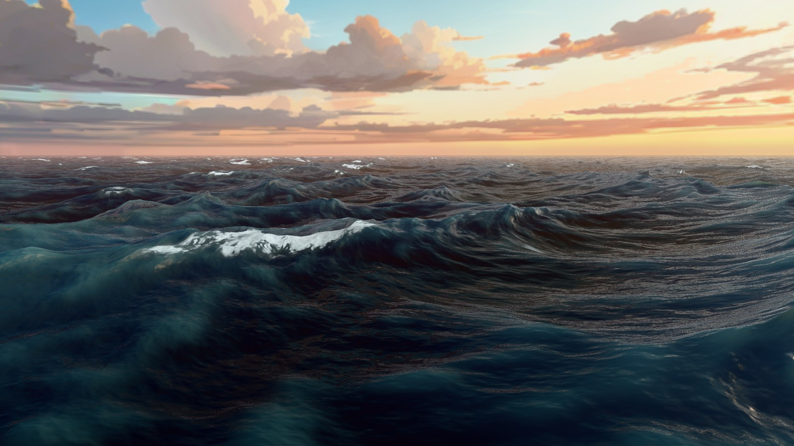
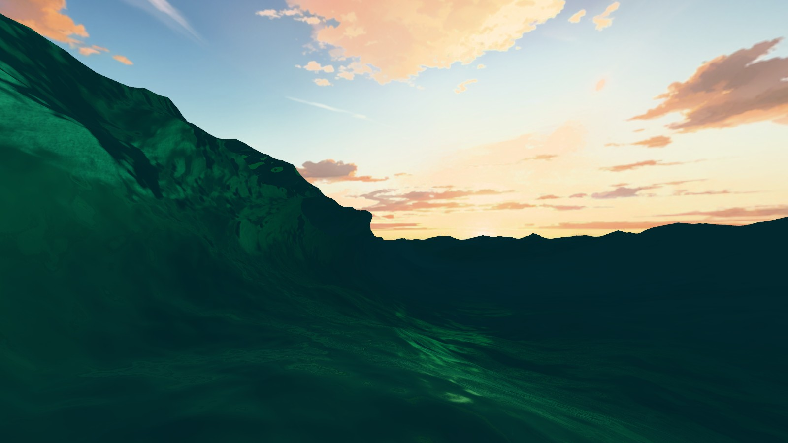
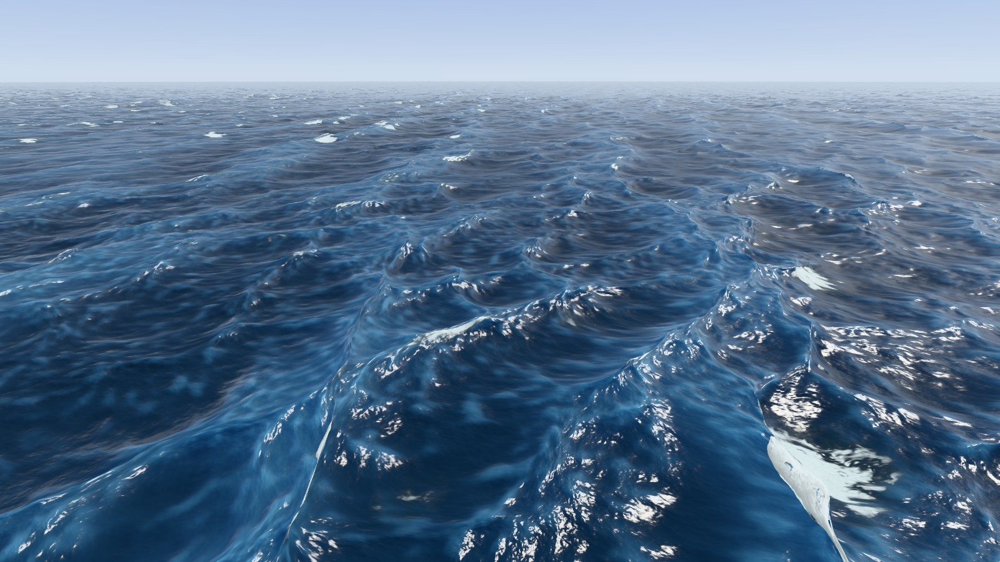
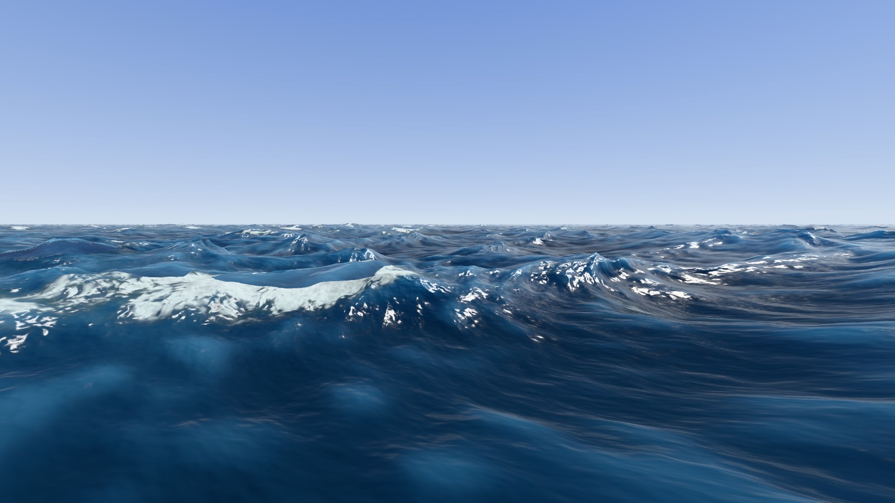
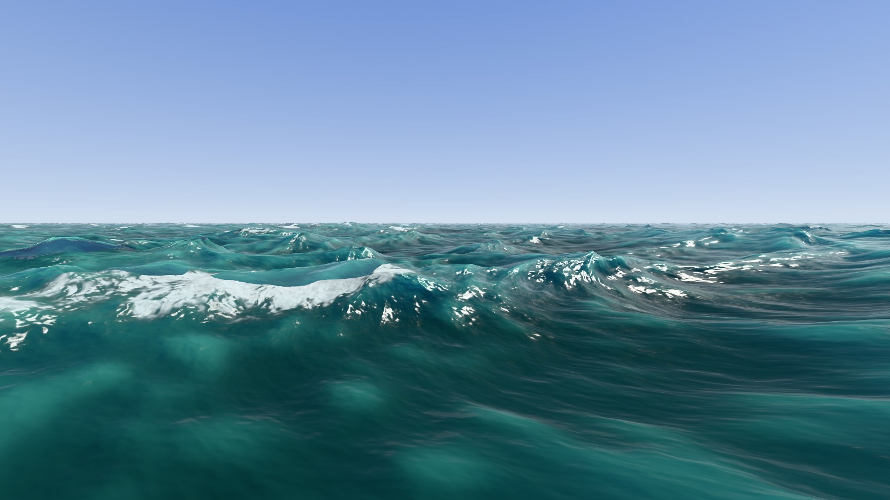

<h1 align="center">Poseidon</h1>

<p align="center">
  A real-time Tessendorf ocean in <a href="https://threejs.org/">Three.js</a>: three cascades of
  inverse FFT running as WebGPU compute shaders, shaded with measured water optics.
</p>

<p align="center">
  
  
  
</p>

<p align="center">
  
</p>

## Run

```bash
npm install
npm run dev
```

Open the printed URL. **WebGPU only, with no WebGL fallback**: Chrome/Edge 113+ or
Safari 18+. If the page reports WebGPU as unavailable on a machine that should have it,
`chrome://flags/#enable-unsafe-webgpu` is the usual culprit.

`npm run build` / `npm run preview` produce and serve a static bundle.

## Controls

The camera is an Unreal-style free look.

| Input | Action |
| --- | --- |
| Hold **right mouse** | Look around |
| **W A S D** | Fly along the view direction |
| **Q** / **E** | Down / up (world space) |
| **Shift** | 4× boost |
| **Mouse wheel** | Fly speed |
| **+** / **−** | Choppiness λ |

The panel on the right tunes sea state (wind speed and direction, amplitude, directionality,
time scale), foam, surface detail and subsurface strength, and the sun. The chips in the
bottom-left switch sea palette (tropical green ↔ open-ocean blue) and sky rig
(midday ↔ golden hour) live.

## The look

<table>
  <tr>
    <td width="50%" valign="top">
      <br>
      <b>Sun glitter.</b> GGX with a knee, over a sun reconstructed from the panorama's clipped disc.
    </td>
    <td width="50%" valign="top">
      <br>
      <b>Whitecaps.</b> Foam where the displacement Jacobian folds, with build/decay so caps linger and streak downwind.
    </td>
  </tr>
  <tr>
    <td width="50%" valign="top">
      <br>
      <b>Subsurface scatter.</b> A thin lip goes warm, a thick one jade, off one exponential over a refracted path.
    </td>
    <td width="50%" valign="top">
      <br>
      <b>Wave field.</b> Three cascades on disjoint wavenumber bands: swell and ripple without visible tiling.
    </td>
  </tr>
  <tr>
    <td width="50%" valign="top">
      <br>
      <b>Open-ocean blue.</b> Jerlov absorption and scattering, not a tinted swatch.
    </td>
    <td width="50%" valign="top">
      <br>
      <b>Tropical green.</b> Same water model, different inherent optical properties.
    </td>
  </tr>
</table>

## What's in it

**Simulation**

- Stockham butterfly IFFT on the GPU, with precomputed twiddle/index buffers
- 3 wave cascades (1024 / 144 / 24 m patches) on disjoint wavenumber bands
- JONSWAP/Horvath directional spectrum: wind sea + swell, TMA depth correction,
  Donelan–Banner spreading
- Wavenumber-weighted choppy displacement: full strength on the swell, rolled off on the
  chop, so crests get sculpted without pinching the ripples
- Foam from the displacement Jacobian, accumulated with build/decay, its coverage targeted
  at the Monahan & O'Muircheartaigh whitecap fraction for the current wind speed

**Shading**

- Exact dielectric Fresnel (n = 1.34) both ways across the interface, so a submerged camera
  gets a real Snell's window (the whole sky inside a 48.3° cone) with total internal
  reflection outside it
- Subsurface scatter built from the three factors it actually has: entry Fresnel on the
  wave's far face, a Henyey–Greenstein forward lobe for the exit, and diffusion
  transmittance over a refracted path
- Sun glitter (GGX with a knee) and self-composited aerial perspective
- Two sky rigs, each carrying its own measured sun colour, intensity, and haze extinction
- ~790k-vertex radial grid recentred on the camera: dense underfoot, sparse at 20 km, so
  the water runs to a real horizon

## Credits

Spectrum and FFT techniques adapted from [gasgiant/FFT-Ocean](https://github.com/gasgiant/FFT-Ocean)
(MIT), based on Tessendorf 2001 (*Simulating Ocean Water*) and Horvath 2015
(*Empirical Directional Wave Spectra for Computer Graphics*).

Water optics (`src/ocean/water.js`) use the Jerlov coastal-water inherent optical properties
tabulated by Solonenko & Mobley 2015,
[*Inherent optical properties of Jerlov water types*](https://doi.org/10.1364/AO.54.005392),
Appl. Opt. 54(17):5392.

The golden-hour sky panorama (`public/sky/sky_131_2k.png`) is
[Skybox 131](https://freestylized.com/skybox/sky_131/) by
[FreeStylized](https://freestylized.com/), used under their custom CC0 license
rather than this project's.
